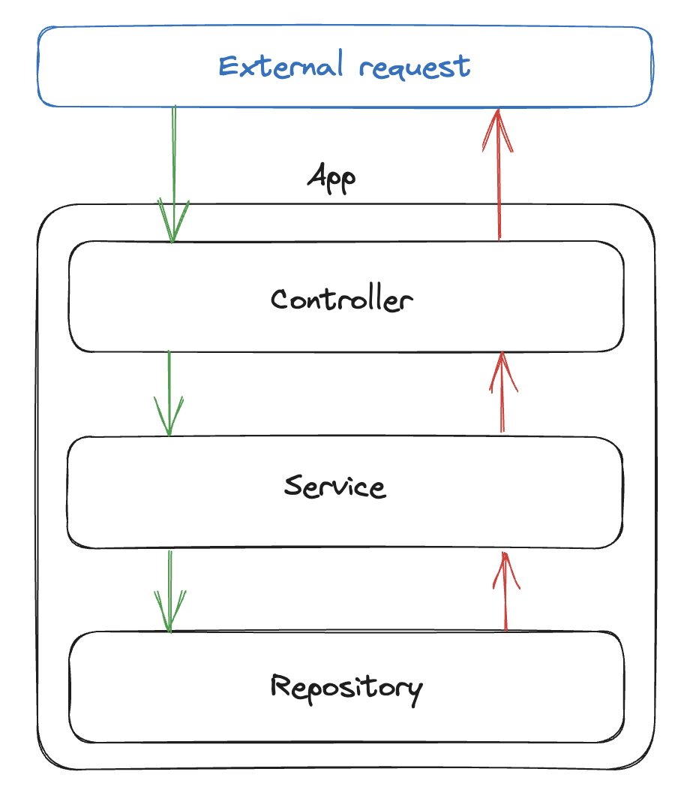

# About 🧑🏻‍💻

This repository contains a simple API that serves as a kickstart for new projects using FastAPI, SQLAlchemy and PostgreSQL. It's built with a simple layered architecture, containing domain, service, repository and controller layers. With this layered architecture approach, it's possible to separate concerns and make the codebase more maintainable and scalable.

<p align="center">
  
</p>

It's also possible to add more layers if responsibilities grow within a specific layer. That being said, it's important to keep in mind that layers should be as independent as possible, and the dependencies should always point inwards, otherwise, could lead to ciclic dependencies mainly because of Pydantic schemas.

- Main frameworks and packages:
  - [FastAPI](https://fastapi.tiangolo.com/)
  - [SQLAlchemy](https://www.sqlalchemy.org/) ([PostgreSQL](https://www.postgresql.org/) database).

# How to run 🏃🏻‍♂️‍➡️

## Install Python

Install [Python](https://www.python.org/downloads/) (version 3.10).

## Set and activate virtual environment

In project folder, execute the following commands:

```bash
pip install pipenv
export PIPENV_VENV_IN_PROJECT="enabled"
mkdir .venv
pipenv shell
source .venv/Scripts/activate
```

## Set environment variables

Create a .env file with the required environment variables see [.env.example]

## Install required dependencies

Run the following installation command:

```bash
pipenv install --dev
```

## Run server

On virtual environment, execute

```bash
pipenv run start
```

## Documentation

While running the server, one can access the [API documentation](http://localhost:1337/docs).
